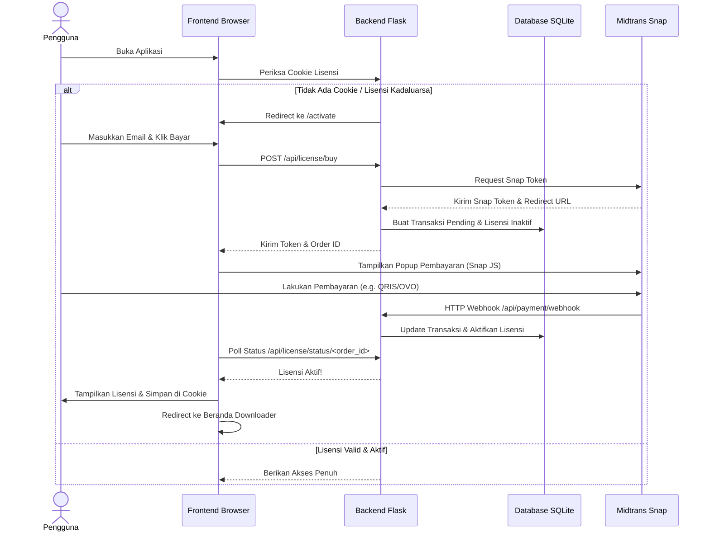

# Dokumentasi Historis Integrasi Midtrans & Sistem Lisensi Premium OmniGet

> [!NOTE]  
> Dokumentasi ini diarsipkan sebagai referensi historis pengembangan. Berdasarkan keputusan terbaru, semua fitur pembayaran, verifikasi lisensi, dan database lisensi telah **dihapus sepenuhnya** dari aplikasi untuk menyediakannya secara **100% gratis** bagi seluruh pengguna di dunia.

---

## 🛠️ Alur Sistem Sebelumnya

Berikut adalah alur sistem otentikasi lisensi dan gerbang pembayaran Midtrans yang sempat diimplementasikan:

---

## ⚙️ Ringkasan Komponen yang Sempat Digunakan
1. **Database SQLite (`licenses.db`)**: Menyimpan data order, status transaksi (pending/success/expire), dan masa aktif lisensi.
2. **Midtrans Snap API**: Digunakan untuk pembuatan transaksi pembayaran dan menangani webhook notifikasi pembayaran dari server Midtrans.
3. **Middleware Lisensi**: Middleware Flask `before_request` memverifikasi keberadaan cookie lisensi aktif pada setiap rute dinamis sebelum memberikan akses.
4. **CLI Generator**: `generate_license.py` digunakan oleh pengelola sistem untuk membuat kunci lisensi manual secara offline.
